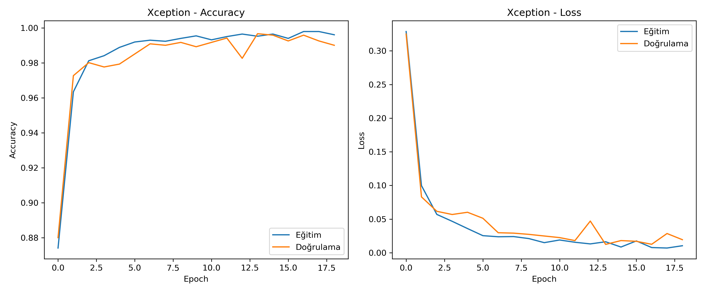
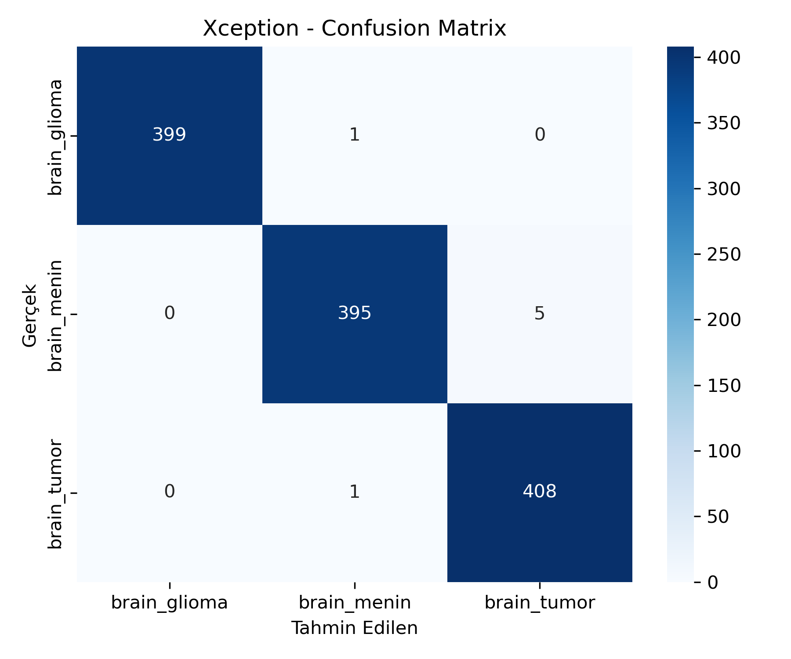
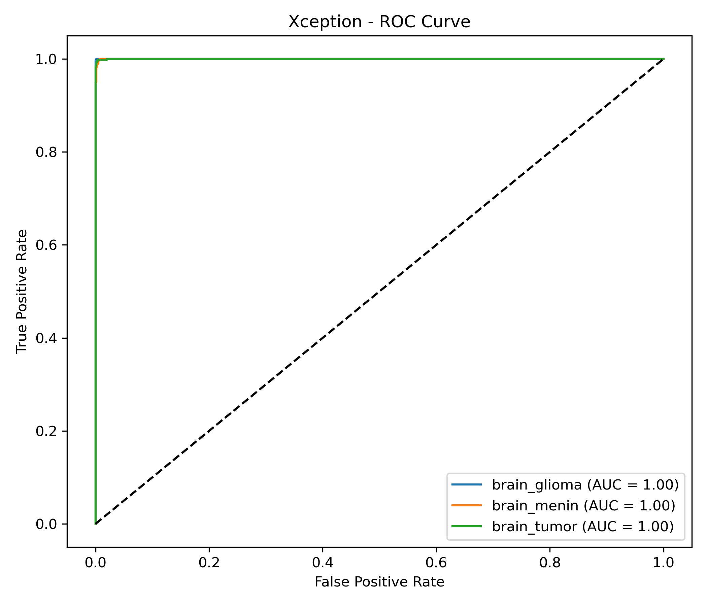

# Python-Beyin-Kanseri-Tespiti
Python, Keras ve Xception mimarisi ile beyin MR görüntülerinden tümör tespiti (%99.67 başarı).
# 🧠 Python & Keras ile Beyin Tümörü Tespiti (Xception Modeli)

Bu proje, bir derin öğrenme modeli kullanarak beyin MR görüntülerinde tümörlü ve sağlıklı dokuları sınıflandırmak amacıyla geliştirilmiştir. Model, **Xception** mimarisi temel alınarak ve **Transfer Learning (Aktarımlı Öğrenme)** tekniği kullanılarak Python ve Keras kütüphaneleri ile eğitilmiştir.

---

## 🚀 Projenin Amacı ve Kapsamı

Bu modelin temel amacı, tıbbi görüntüleri analiz ederek radyologlara ve tıp uzmanlarına yönelik bir **karar destek sistemi** için bir prototip oluşturmaktır.

Model, kendisine verilen bir 2D MR görüntüsünü **3 farklı sınıftan** biri olarak sınıflandırmak üzere eğitilmiştir:

* **[Sınıf 1: örn: brain_glioma]**
* **[Sınıf 2: örn: brain_menin]**
* **[Sınıf 3: örn: brain_tumor]**
---
## 🛠️ Kullanılan Teknolojiler

* **Dil:** Python
* **Derin Öğrenme:** TensorFlow, Keras
* **Temel Mimari:** Xception (Transfer Learning)
* **Veri İşleme & Analiz:** NumPy, Pandas, Scikit-learn (Veri setini bölmek için)
* **Görüntü İşleme:** OpenCV (cv2)
* **Görselleştirme:** Matplotlib

---

## 📊 Sonuçlar ve Performans

Model, **Xception** mimarisi ve aktarımlı öğrenme tekniği sayesinde test veriseti (validation set) üzerinde olağanüstü bir başarı göstermiştir.

Modelin ulaştığı en yüksek doğruluk oranı:
**%99.67**

Aşağıda, modelin eğitim ve doğrulama (validation) setleri üzerindeki doğruluk/kayıp (accuracy/loss) grafiği yer almaktadır.

Aşağıda modelin bir test görüntüsü üzerinde yaptığı Confusion grafiği almaktadır:

Aşağıda modelin bir test görüntüsü üzerinde yaptığı Roc grafiği almaktadır:

---

## 📁 Veri Seti

Bu projede kullanılan veri seti, **Kaggle** platformundan temin edilmiş, beyin kanseri teşhisine yönelik 3 sınıflı (Glioma, Menin, Tumor) etiketlenmiş MR görüntülerinden oluşmaktadır.
